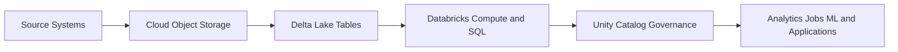
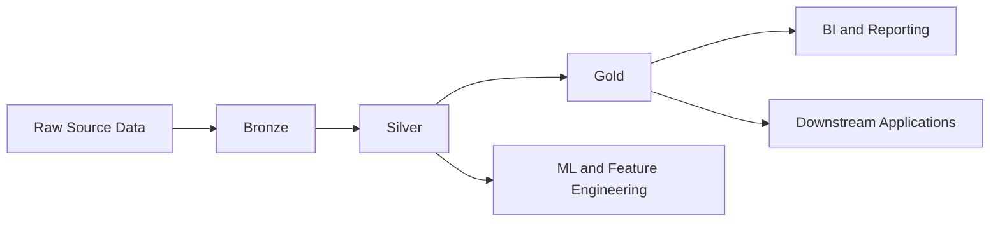

# 02 - Delta Lake and Lakehouse Architecture

## What is Delta Lake

Delta Lake is an open table format and storage layer that adds reliability and management features to data stored in a data lake.

In plain terms, Delta Lake helps you treat files in cloud storage more like managed tables instead of a loose collection of raw files.

## Why Delta Lake exists

Traditional data lakes are flexible and cheap, but they often create operational problems:

- No reliable transactions across concurrent writes
- Weak schema control
- Hard-to-manage updates and deletes
- Poor support for audit and rollback
- Small-file and consistency problems in large pipelines

Delta Lake addresses these gaps by adding table semantics on top of cloud object storage.

## Core Delta Lake features

### ACID transactions

Multiple readers and writers can work with the same table more safely because Delta tracks committed changes transactionally.

### Schema enforcement

Delta helps prevent accidental writes with the wrong schema.

### Schema evolution

When needed, schemas can evolve in a controlled way as the data model changes.

### Time travel

You can query older versions of a table for audit, debugging, or recovery scenarios.

### Merge, update, and delete

Delta supports row-level data changes, which is critical for CDC, upserts, and corrections.

### Table history

Delta records change history so you can inspect how and when a table changed.

## Simple Delta example

```python
data = [(1, "Alice", 100.0), (2, "Bob", 250.0)]

df = spark.createDataFrame(data, ["customer_id", "customer_name", "spend"])

df.write.format("delta").mode("overwrite").saveAsTable("main.demo.customer_spend")
```

## What is lakehouse architecture

Lakehouse architecture is a data architecture pattern that combines:

- The low-cost, scalable storage of a data lake
- The management and performance features expected from a data warehouse

Instead of separating raw storage and analytical serving into completely different platforms, the lakehouse tries to unify them on top of cloud storage with managed table formats.

## Data lake vs warehouse vs lakehouse

| Characteristic | Data Lake | Data Warehouse | Lakehouse |
| --- | --- | --- | --- |
| Storage cost | Low | Higher | Low to moderate |
| Data types | Structured and unstructured | Mostly structured | Structured and unstructured |
| Governance | Often weaker by default | Stronger | Strong with the right platform layers |
| Transactions | Limited in plain files | Strong | Strong with Delta-style table formats |
| BI friendliness | Often weaker | Strong | Strong |
| ML friendliness | Strong | Often less flexible | Strong |

## How lakehouse works in Databricks

In Databricks, lakehouse architecture typically looks like this:



## Typical medallion layering

Many Databricks lakehouse implementations use the medallion pattern.



### Bronze

- Raw or minimally processed data
- Close to source format
- Useful for replay and audit

### Silver

- Cleaned, standardized, and joined data
- Better suited for reusable analytics and features

### Gold

- Business-ready aggregates and serving tables
- Optimized for reporting, KPIs, and consumption

## Why Delta Lake matters to the lakehouse

Lakehouse architecture is the design pattern.

Delta Lake is one of the main enabling technologies that makes the pattern work in production, because it adds the reliability and manageability that plain object storage does not provide by itself.

## Practical example

Imagine a retail pipeline:

1. Raw order files land in cloud storage
2. Bronze Delta tables store raw ingested records
3. Silver Delta tables clean duplicates and standardize schemas
4. Gold Delta tables aggregate daily sales by region and product
5. Analysts query the gold tables with SQL
6. Data scientists use silver and gold tables for features and training

## When to explain the terms separately

- Use Delta Lake when talking about table format, transactions, merge, time travel, or storage behavior
- Use lakehouse architecture when talking about the overall platform design and data flow

## One-line distinction

Delta Lake is the data management layer for tables.

Lakehouse architecture is the broader architectural model that uses those managed tables to support analytics and AI workloads on top of cloud storage.