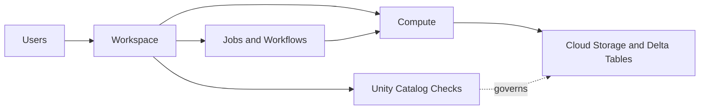
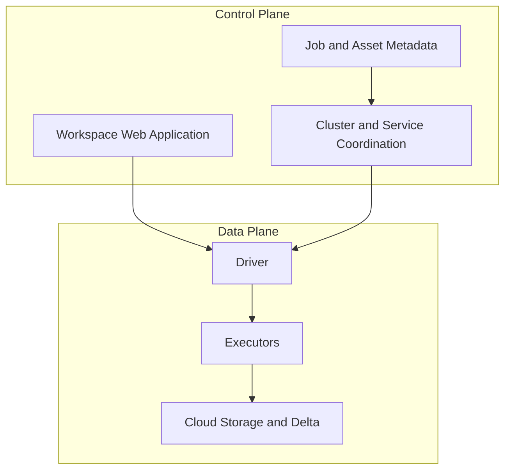

# 03 - Architecture, Workspace, and Compute

## High-level architecture

Databricks typically separates platform responsibilities into a control plane and a data plane.

### Control plane

Managed by Databricks. This layer usually includes:

- Workspace web application
- Job orchestration metadata
- Notebook and asset metadata
- Cluster manager and service coordination

### Data plane

Runs the compute resources that process data. Depending on the cloud and deployment model, this is where your Spark executors and drivers run and where they access storage.

## Conceptual flow



## Platform layers diagram



## What is a workspace

A workspace is the collaborative surface where users interact with Databricks.

Common workspace assets:

- Notebooks
- Repos
- Jobs and workflows
- Dashboards
- Experiments
- Files and workspace objects

Think of the workspace as the operating environment for teams, not as the storage system for your production data.

## What is compute

Compute is the execution layer that runs notebooks, jobs, SQL, or ML workloads.

### Common compute options

#### All-purpose compute

- Best for development, ad hoc exploration, and collaborative debugging
- Shared across interactive users

#### Job compute

- Best for automated pipelines and scheduled tasks
- Typically created for the run and terminated after completion

#### SQL warehouse

- Best for BI queries, dashboards, and SQL-centric analytics

## Access modes and isolation

Depending on your Databricks setup, compute can be configured with different access modes and policies.

Why this matters:

- Security posture
- User isolation
- Compatibility with Unity Catalog
- Cost and concurrency behavior

## Spark cluster roles

- Driver: coordinates execution and owns the Spark session
- Executors: perform distributed work on partitions of data

## Common Spark parameters

These are not the only parameters that matter, but they come up often.

| Parameter | Why it matters | Example |
| --- | --- | --- |
| `spark.sql.shuffle.partitions` | Controls shuffle parallelism for joins and aggregations | `200` |
| `spark.executor.memory` | Memory per executor | `8g` |
| `spark.executor.cores` | Number of cores per executor | `4` |
| `spark.driver.memory` | Memory for the driver process | `8g` |
| `spark.sql.adaptive.enabled` | Enables adaptive query execution | `true` |
| `spark.databricks.delta.optimizeWrite.enabled` | Improves Delta write layout in many cases | `true` |
| `spark.databricks.delta.autoCompact.enabled` | Helps compact small files after writes | `true` |

## Parameter guidance

- Do not tune parameters blindly
- Start from workload symptoms: skew, spilling, long shuffles, too many small files, underutilized cores
- Use job runs, Spark UI, and execution metrics to validate a change

## Practical examples

### Example 1: Lower shuffle partitions for a small dataset

```python
spark.conf.set("spark.sql.shuffle.partitions", "8")
```

### Example 2: Enable adaptive query execution

```python
spark.conf.set("spark.sql.adaptive.enabled", "true")
```

### Example 3: Enable Delta write optimization

```python
spark.conf.set("spark.databricks.delta.optimizeWrite.enabled", "true")
spark.conf.set("spark.databricks.delta.autoCompact.enabled", "true")
```

## Architecture takeaways

- Workspace is where users and assets live
- Compute is where execution happens
- Cloud storage is where data usually resides
- Unity Catalog governs access to data and related assets
- Spark parameters influence how efficiently workloads run