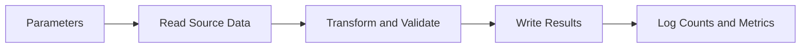
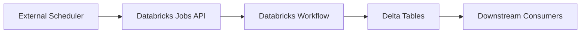

# 05 - Notebooks, Jobs, and Scheduling

## Notebooks

Databricks notebooks are interactive documents that combine:

- Code
- Markdown documentation
- Query results
- Visualizations

They are commonly used for:

- Exploration and prototyping
- Data analysis
- ETL development
- Demonstrations and training

## Why notebooks are useful

- Fast iteration with live results
- Easy collaboration across teams
- Good for combining explanation and code in one place

## Notebook example pattern

A common notebook flow looks like this:

1. Define input parameters
2. Read source data
3. Transform and validate data
4. Write results to a managed table or path
5. Log counts or metrics



## Parameterizing notebooks

In Databricks, notebook parameters are often implemented with widgets.

Example:

```python
dbutils.widgets.text("load_date", "2026-04-01", "Load Date")
dbutils.widgets.dropdown("run_mode", "incremental", ["incremental", "full"], "Run Mode")

load_date = dbutils.widgets.get("load_date")
run_mode = dbutils.widgets.get("run_mode")
```

This makes the same notebook reusable for both interactive runs and scheduled jobs.

## Jobs and workflows

Jobs are used to run notebooks, Python scripts, SQL tasks, or multi-step workflows in a repeatable and automated way.

Common job features:

- Task dependencies
- Retries
- Scheduling
- Notifications
- Parameters
- Job clusters or shared compute

## Typical workflow design

Example pipeline:

1. Ingest raw files
2. Validate and standardize records
3. Load curated Delta tables
4. Run quality checks
5. Publish downstream tables or alerts

Each step can be implemented as a separate task within a Databricks workflow.

## Schedulers

Schedulers automate when a job runs.

Typical options:

- Cron-based schedule
- Triggered by an upstream system
- Event-based or file-arrival orchestration through adjacent platform tooling

## Databricks native scheduler

Databricks jobs include a built-in scheduler for recurring execution.

This is usually the simplest option when:

- The workflow runs entirely inside Databricks
- You only need time-based scheduling
- Task dependencies are already handled within a Databricks workflow
- The pipeline does not depend on complex cross-system orchestration logic

Common native scheduler capabilities:

- Cron-style schedules
- Timezone-aware scheduling options depending on configuration
- Retries and failure notifications
- Task dependencies inside the workflow itself
- Parameterized job runs

## External schedulers

External schedulers are orchestration systems outside Databricks that trigger Databricks jobs or API calls.

Common examples:

- Apache Airflow
- Azure Data Factory
- Azure Synapse pipelines
- AWS Step Functions
- Control-M
- Jenkins or GitHub Actions for operational automation
- Enterprise schedulers used across multiple platforms

## When to use an external scheduler

Use an external scheduler when:

- Your workflow spans Databricks and non-Databricks systems
- You need one orchestrator for many tools and platforms
- You need centralized enterprise dependency management
- Upstream systems must trigger Databricks jobs conditionally
- You need approvals, broader operational controls, or organization-wide scheduling standards

## Native scheduler vs external scheduler

| Topic | Databricks native scheduler | External scheduler |
| --- | --- | --- |
| Best for | Databricks-centric workflows | Cross-platform orchestration |
| Setup complexity | Lower | Higher |
| Operational ownership | Mostly inside Databricks | Shared with orchestration platform |
| Cross-system dependencies | Limited compared to enterprise orchestrators | Strong |
| Visibility across many systems | Lower | Higher |
| Speed of implementation | Faster | Slower but broader |

## Common orchestration patterns

### Pattern 1: Fully native Databricks scheduling

Use Databricks jobs and workflows only.

Good fit for:

- Bronze to Silver to Gold data pipelines entirely inside Databricks
- Scheduled notebook or Python jobs
- Small to medium platform scope

### Pattern 2: External scheduler triggers Databricks job

An external orchestrator calls the Databricks Jobs API or SDK.

Good fit for:

- Enterprise orchestration standards
- Centralized monitoring across multiple systems
- Pipelines that depend on SAP, APIs, file transfers, databases, and Databricks together

### Pattern 3: Event-driven orchestration

A file arrival, message, or upstream application event triggers a Databricks run.

Good fit for:

- Near real-time ingestion
- Upstream-system-driven processing
- Hybrid pipelines where time-based cron is not enough

## Example external scheduler flow



## Airflow-style pattern

In Airflow or a similar orchestrator, the common design is:

1. Wait for an upstream dependency
2. Trigger a Databricks job through an operator or API call
3. Monitor the Databricks run status
4. Continue to the next downstream system only if the Databricks run succeeds

## ADF-style pattern

In Azure Data Factory or similar tools, the common design is:

1. Move or validate source data
2. Trigger a Databricks notebook or job activity
3. Capture output and run status
4. Continue orchestration for storage, SQL, or reporting steps

## Scheduler design guidance

- Use Databricks native scheduling when Databricks is the whole pipeline center
- Use an external scheduler when Databricks is only one part of a larger enterprise workflow
- Avoid duplicating orchestration logic in both Databricks and an external scheduler unless there is a clear reason
- Keep task responsibilities clear: orchestration outside, processing inside
- Standardize retry and alert ownership so failures are not handled inconsistently

## Cron example

Run every day at 6:00 AM:

```text
0 0 6 * * ?
```

Always verify the cron format expected by the scheduler configuration in your Databricks environment.

## Scheduler best practices

- Define clear ownership for retries, notifications, and SLA monitoring
- Avoid overlapping schedules that can trigger competing runs unless concurrency is designed intentionally
- Use idempotent jobs where possible so reruns are safe
- Pass run dates and other parameters explicitly from the scheduler into Databricks jobs
- Record run metadata for auditing and troubleshooting
- Prefer API-driven triggering for external orchestration rather than manual notebook execution

## Notebooks vs jobs

| Topic | Notebook | Job |
| --- | --- | --- |
| Purpose | Interactive development and documentation | Production execution and orchestration |
| User pattern | Human-driven | Automated |
| State | Often iterative and exploratory | Repeatable and versioned |
| Scheduling | Manual or indirect | Native scheduling support |

## Practical best practices

- Keep notebooks modular and readable
- Move complex reusable logic into Python modules or repos when notebooks get large
- Use widgets or task parameters instead of hardcoded dates and paths
- Separate development compute from production job compute
- Add retries and alerting for scheduled workloads
- Use Unity Catalog tables and consistent naming standards for outputs
- Choose native or external scheduling based on orchestration scope, not team habit