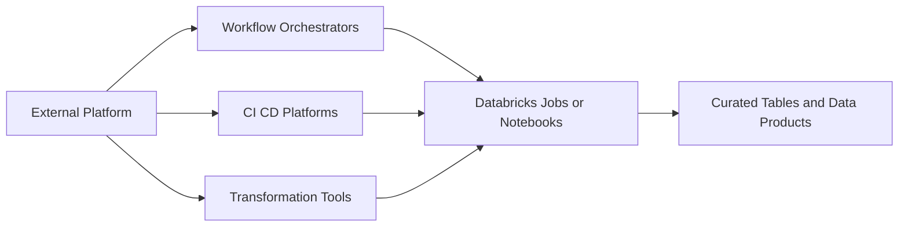
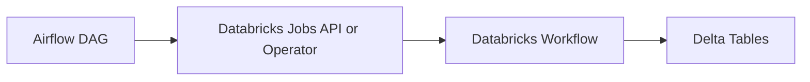
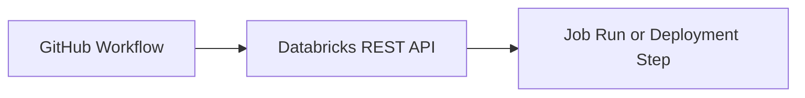
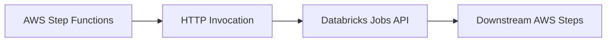
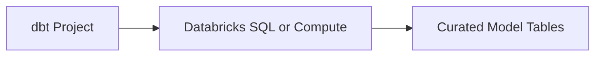

# 14 - External Integrations

## Why external integrations matter

Databricks does not need to operate in isolation.

In many real environments, Databricks is one part of a larger delivery flow that includes:

- enterprise schedulers
- CI/CD platforms
- cloud-native workflow services
- transformation tools such as dbt
- upstream systems that trigger jobs when data arrives

The goal of an integration is usually one of these:

- trigger a Databricks job or notebook
- pass parameters into Databricks runs
- coordinate Databricks with other systems
- standardize deployment and operational control

## Common integration categories

### Workflow orchestrators

These tools trigger or monitor Databricks work as one step in a larger pipeline.

Examples:

- Apache Airflow
- Azure Data Factory
- AWS Step Functions
- Control-M or other enterprise schedulers

Use them when:

- Databricks is only one part of the workflow
- you need central orchestration across multiple systems
- upstream dependencies live outside Databricks

### CI/CD platforms

These tools help automate deployment or execution around source control events.

Examples:

- GitHub Actions
- Azure DevOps
- Jenkins

Use them when:

- code merges should trigger validation or deployment
- you want API-driven job runs from versioned workflows
- deployment logic lives outside the Databricks workspace

### Transformation tools

These tools focus on data modeling and SQL transformation rather than general orchestration.

Example:

- dbt on Databricks

Use them when:

- teams want model-based SQL development
- transformations should be versioned and testable in a dbt project
- gold-layer style outputs are managed as dbt models

## What the integrations folder contains

This repo includes a dedicated `integrations/` folder with simple examples for:

- Airflow job triggering
- Azure Data Factory notebook activities
- GitHub Actions job triggering
- AWS Step Functions job orchestration
- dbt project structure for Databricks models

These are intentionally compact examples for learning and adaptation.

## When to use native Databricks orchestration instead

Use native Databricks Jobs when:

- the workflow is mostly inside Databricks
- task dependencies are all Databricks tasks
- you do not need a broader enterprise orchestrator

Use external integrations when:

- Databricks depends on non-Databricks systems
- scheduling standards are owned centrally
- CI/CD pipelines must control execution or deployment
- cloud-native services coordinate multiple platforms together

## Example integration patterns

### Airflow to Databricks

Pattern:

Good fit for centralized orchestration and dependency management.

### Azure Data Factory to Databricks

Pattern:

Good fit for Azure-centric enterprise data platforms.

### GitHub Actions to Databricks

Pattern:

Good fit for source-controlled automation and lightweight operational triggers.

### Step Functions to Databricks

Pattern:

Good fit for AWS-native workflow coordination.

### dbt on Databricks

Pattern:

Good fit when transformation logic is primarily SQL-driven and managed as versioned models.

## Practical guidance

- keep orchestration responsibilities outside Databricks only when there is a clear need
- pass parameters explicitly instead of hardcoding dates and modes
- keep secrets in the orchestrator's secret store or managed identity flow
- make Databricks jobs idempotent so retries are safer
- log run IDs and parameters so failures can be traced across systems

## One-line summary

Use external integrations when Databricks must fit into a broader platform workflow, not just when another tool happens to be available.