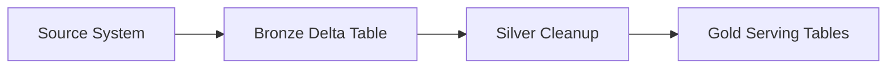
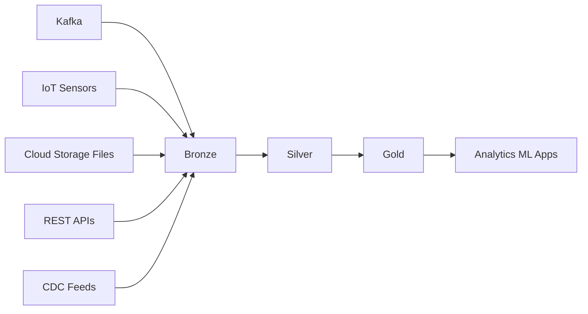
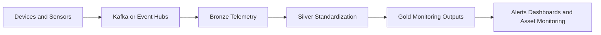

# 15 - Real-World Ingestion Use Cases

## Why ingestion patterns matter

Most Databricks projects are not about loading one static CSV once.

Real ingestion work usually means connecting Databricks to operational systems that produce:

- event streams
- IoT telemetry
- application logs
- CDC feeds
- API payloads
- batch file drops from partners or upstream systems

The ingestion design determines how reliable, fast, and reusable the downstream lakehouse will be.

## Common ingestion goals

Real ingestion pipelines usually need to do some combination of these:

- land raw data with minimal loss
- support replay when downstream logic changes
- preserve event time and source metadata
- handle late or duplicate records
- scale across large volumes of small events
- separate raw ingestion from business transformation

In Databricks, the standard pattern is usually:

## Ingestion landscape diagram

## Use case 1: Ingesting Kafka events into Databricks

Kafka is a common source for application events, clickstreams, payments, telemetry, and operational messages.

Typical Databricks pattern:

1. Read Kafka topics with Structured Streaming
2. Capture Kafka metadata such as topic, partition, offset, and ingest timestamp
3. Parse the event payload from JSON or Avro into columns
4. Write the raw event stream into a bronze Delta table
5. Build silver and gold layers from the bronze stream or downstream batch logic

Why this pattern works:

- Kafka gives scalable event transport
- Databricks handles distributed parsing and transformation
- Delta provides durable storage and replayable ingestion history

Typical Kafka bronze fields:

- `topic`
- `partition`
- `offset`
- `key`
- `value`
- `event_ts`
- `ingest_ts`

Practical concerns:

- checkpointing must be configured carefully
- parsing errors should be isolated instead of failing every downstream step
- consumer lag and backpressure need monitoring
- event schemas should be versioned and validated

## Use case 2: Ingesting IoT sensor data

IoT systems often send high-volume device telemetry such as temperature, vibration, pressure, location, or machine-state events.

Common source paths include:

- Kafka or Event Hubs
- MQTT forwarded into cloud storage or a message bus
- periodic file drops in object storage
- IoT platform export APIs

Typical Databricks pattern:

1. Land raw device telemetry in bronze
2. Preserve device ID, event time, and raw payload
3. Standardize units and timestamps in silver
4. Filter bad telemetry and quarantine impossible readings
5. Aggregate by time window, device, site, or asset in gold

Example gold outputs:

- average temperature by device every 5 minutes
- anomaly candidate counts by plant
- device heartbeat gap reports
- latest sensor status by asset

Practical concerns:

- device timestamps can be late or out of order
- telemetry volumes are often high and continuous
- duplicates are common after retries or reconnects
- some devices send malformed or partial payloads

## Use case 3: Ingesting files from cloud storage

This is one of the most common enterprise patterns.

Examples:

- CSV exports from legacy systems
- JSON application logs
- parquet files from partner platforms
- daily finance or ERP extracts

Typical Databricks pattern:

1. Use Auto Loader to discover new files incrementally
2. Store raw files in a bronze landing schema or path
3. Capture file metadata such as source file and load timestamp
4. Clean and type the data into silver
5. Publish curated tables for consumers

Why teams use Auto Loader:

- scalable file discovery
- better operational reliability than manual file listing
- support for schema tracking and incremental ingestion

## Use case 4: Ingesting API data

Many operational systems expose REST APIs rather than direct database or file access.

Examples:

- SaaS business applications
- CRM systems
- ticketing tools
- logistics and external partner platforms

Typical Databricks pattern:

1. Pull API responses on a schedule or trigger
2. Store raw payloads in bronze with request metadata
3. Flatten and standardize nested responses in silver
4. Publish reporting or analytics tables in gold

Practical concerns:

- rate limits
- pagination
- retry logic
- incremental extraction using updated timestamps or tokens
- preserving the raw response for audit and replay

## Use case 5: CDC from transactional systems

Change data capture is common when Databricks must stay close to operational databases.

Typical sources:

- database CDC tools landing files in storage
- Kafka topics carrying change events
- ingestion products that emit inserts, updates, and deletes

Typical Databricks pattern:

1. Ingest raw change events to bronze
2. Standardize the CDC payload in silver
3. Apply inserts, updates, and deletes with Delta `MERGE`
4. Publish business-ready tables in gold

Practical concerns:

- delete semantics must be handled explicitly
- event ordering matters
- duplicate change events must be deduplicated
- watermarking and replay strategy should be defined up front

## How to choose an ingestion pattern

| Source type | Common Databricks pattern | Best fit |
| --- | --- | --- |
| Kafka events | Structured Streaming + Delta bronze | near real-time event pipelines |
| IoT telemetry | streaming or micro-batch bronze to silver to gold | sensor and device analytics |
| Cloud storage files | Auto Loader + Delta | scalable batch and incremental file landing |
| REST APIs | scheduled extraction + bronze raw payloads | SaaS and external system ingestion |
| CDC feeds | Delta merge pipelines | operational replication and analytics |

## Design guidance that applies to all of them

- always keep a replayable bronze layer
- record source metadata such as file name, offset, device ID, or request window
- keep parsing and validation logic out of raw landing where possible
- push business logic downstream into silver and gold
- make ingestion idempotent so reruns are safer
- monitor freshness, counts, and rejected records

## One-line summary

The best Databricks ingestion design depends on the source, but the reliable pattern is usually the same: land raw data first, preserve metadata, then curate it through medallion layers.