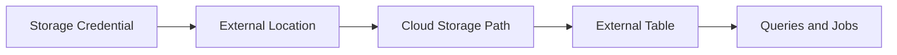

# 19 - External Tables, External Locations, and Storage Credentials

## Why these terms matter together

When teams move deeper into Unity Catalog, they usually start hearing three connected terms:

- external table
- external location
- storage credential

These are related, but they are not the same thing.

People often mix them up because all three are part of governed access to cloud storage in Databricks.

## Short answer

| Term | What it is | Main purpose |
| --- | --- | --- |
| External table | A table whose data lives at an explicitly defined storage path | Register governed table metadata for externally located data |
| External location | A governed reference to a storage path | Control access to cloud storage paths in Unity Catalog |
| Storage credential | A credential object used to access cloud storage securely | Authorize access to the underlying storage |

## The relationship in one sentence

Storage credentials authorize access, external locations define governed paths, and external tables register data stored at those paths.

## What is a storage credential

A storage credential is the secure access object that tells Databricks how it can authenticate to cloud storage.

Examples might involve:

- cloud IAM roles
- service principals
- managed identities
- other supported credential models depending on cloud platform

The important point is that a storage credential is not the table itself and not the path itself.

It is the secure access mechanism behind governed storage access.

## What is an external location

An external location is a governed object in Unity Catalog that points to a cloud storage path and uses a storage credential.

This lets platform teams govern access to storage paths without hardcoding credentials into notebooks or jobs.

An external location usually answers questions like:

- which storage path is allowed?
- which credential is used to access it?
- who is allowed to use that path in Databricks?

## What is an external table

An external table is a table registered in Databricks whose data lives at an explicitly defined external path instead of the default managed storage path.

That path is often governed through an external location.

This means:

- the table metadata is registered in Databricks
- the data files remain at a specified external storage path
- the platform can still govern and query the table

## Diagram



## How these objects work together

A common Unity Catalog flow looks like this:

1. Create a storage credential
2. Create an external location that uses that credential and points to a storage path
3. Create an external table that reads from or writes to data at that governed path

This separates concerns cleanly:

- credential management
- storage-path governance
- table registration and querying

## Why not just use raw cloud paths everywhere

Without governed storage objects, teams often end up with:

- hardcoded paths in notebooks
- inconsistent credential handling
- weak visibility into who can access which storage locations
- harder-to-manage security boundaries

Unity Catalog external locations and storage credentials help standardize that model.

## Managed table vs external table in this context

Managed and external tables answer the storage-lifecycle question.

External locations and storage credentials answer the governed-storage-access question.

So the relationship is:

- managed vs external: where and how table data is owned
- external location: what storage path is governed
- storage credential: how Databricks is allowed to access that path

## Example mental model

Think of it like this:

- storage credential = the key
- external location = the approved doorway
- external table = the registered data object behind that doorway

## Example SQL shape

The exact syntax varies by environment and cloud setup, but the conceptual flow looks like this:

```sql
CREATE STORAGE CREDENTIAL my_storage_credential
  ...;

CREATE EXTERNAL LOCATION my_external_location
  URL 's3://example-bucket/data/'
  WITH (STORAGE CREDENTIAL my_storage_credential);

CREATE TABLE main.demo.orders_external
USING DELTA
LOCATION 's3://example-bucket/data/orders';
```

Treat this as conceptual shape rather than copy-paste production SQL.

## When to use external tables

- storage paths must be explicitly controlled
- cloud storage is shared across tools or teams
- platform standards require path-level governance
- the data should remain outside the default managed-table storage pattern

## When external locations matter most

- multiple tables or volumes depend on governed storage paths
- access must be standardized through Unity Catalog
- platform teams want cleaner separation of storage access and query logic

## Common misunderstanding

People sometimes think external location and external table mean the same thing.

They do not.

- external location is the governed storage-path object
- external table is the registered table object using data at a storage path

## Practical rule

If you are talking about secure access to storage paths, think storage credential and external location.

If you are talking about a queryable table whose data lives at an explicit path, think external table.

## One-line summary

Storage credentials provide secure access, external locations govern storage paths, and external tables register data stored at those governed paths.