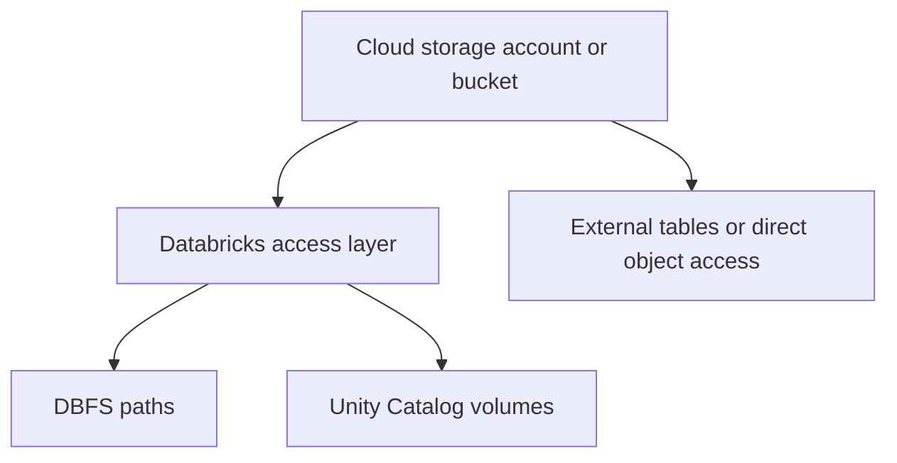
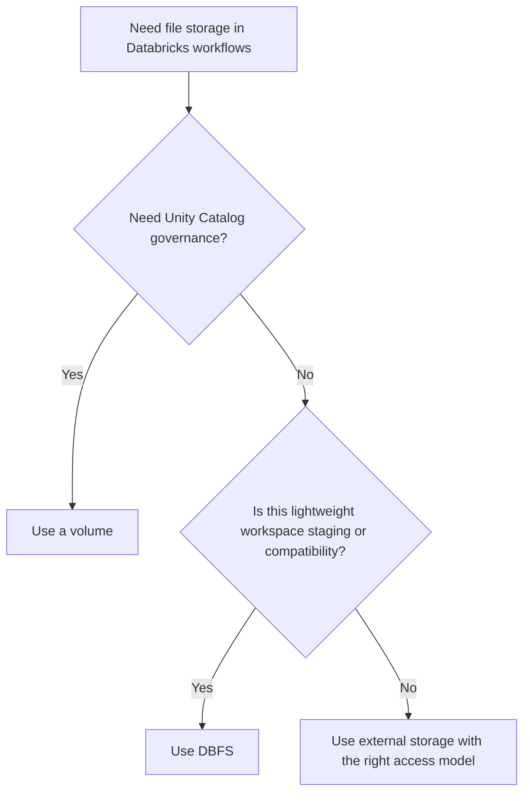

# 20 - DBFS vs Volumes vs External Storage

This tutorial explains three storage concepts that are often mixed together in Databricks:

- DBFS
- Unity Catalog volumes
- external cloud storage

They are related, but they are not the same thing.

## Short version

- DBFS is a Databricks-access pattern and workspace-level file area
- volumes are Unity Catalog-governed file paths for non-tabular data
- external storage is the underlying cloud storage account, bucket, or container outside Databricks

## The mental model

Think in layers:

The underlying storage lives in your cloud provider.
Databricks gives you multiple ways to reference or govern what is stored there.

## What DBFS is

DBFS stands for Databricks File System.

In practice, people usually mean one of these:

- `dbfs:/` paths used by notebooks, jobs, and APIs
- workspace-managed file areas such as `dbfs:/FileStore/`
- a compatibility path used by older examples and cluster-level file references

DBFS is commonly used for:

- small support files
- temporary artifacts
- uploaded JARs or wheels for cluster installation
- quick demos and older operational patterns

Example paths:

- `dbfs:/tmp/demo-file.json`
- `dbfs:/FileStore/jars/example-library.jar`

## What volumes are

Volumes are a Unity Catalog feature for governing files that are not tables.

They are a better fit than raw DBFS when you want:

- catalog and schema alignment
- clearer governance boundaries
- permissions managed through Unity Catalog
- a modern place for files used by teams and pipelines

Example path shape:

- `/Volumes/main/engineering/raw-files/`

Use volumes when you need managed access to files such as:

- ML features or artifacts
- inbound CSV or JSON files
- reference files used by pipelines
- documents or unstructured assets used in governed workflows

## What external storage is

External storage is the real cloud storage location outside the Databricks control plane.

Examples:

- Amazon S3 buckets
- Azure Data Lake Storage Gen2 containers
- Google Cloud Storage buckets

This is where the actual bytes live.

Databricks can access that storage through:

- external locations
- storage credentials
- instance profiles or service principals
- direct connectors or mounted legacy patterns

## When to use each one

### Use DBFS when

- you need a quick workspace-scoped file path
- you are following an older example that expects `dbfs:/`
- you want to attach a JAR or wheel to a cluster from a simple DBFS path

### Use volumes when

- you want Unity Catalog governance for files
- multiple teams need governed file access
- the files are important enough to manage like a shared platform asset

### Use external storage directly when

- data must stay in a specific storage account or bucket
- you are defining external tables or external locations
- you want cloud-native storage ownership outside Databricks-managed areas

## Recommended direction

For modern Databricks environments:

- use Unity Catalog volumes for governed file assets
- use external locations and storage credentials for cloud storage access
- use DBFS mainly for compatibility, lightweight operational files, or simple dependency staging

## Common confusion to avoid

### DBFS is not a separate storage system

DBFS is not its own cloud storage product.
It is a Databricks path abstraction and workspace-oriented access pattern over underlying storage.

### Volumes are not tables

Volumes store files, not relational table metadata.
They complement tables when you need governed non-tabular data.

### External storage is broader than Databricks

Your object storage exists independently of Databricks.
Databricks connects to it and governs access based on your configuration.

## Practical examples

### Example 1: install a JAR on a cluster

1. Upload the file to `dbfs:/FileStore/jars/example-library.jar`
2. Call the libraries API
3. Attach the JAR to the cluster

This is why DBFS still appears often in dependency-management examples.

### Example 2: share JSON reference files across teams

1. Create a Unity Catalog volume
2. Grant access through Unity Catalog
3. Read files from `/Volumes/<catalog>/<schema>/<volume>/...`

This is a stronger pattern for shared governed file assets.

### Example 3: keep data in your cloud storage account

1. Define a storage credential
2. Define an external location
3. Use external tables or file access patterns against that location

This is the standard pattern when storage ownership stays with the cloud account.

## Decision guide

## Related tutorials

- Tutorial 18 explains managed vs external tables
- Tutorial 19 explains external tables, external locations, and storage credentials
- Tutorial 09 explains Databricks REST and SDK automation, including DBFS and library examples